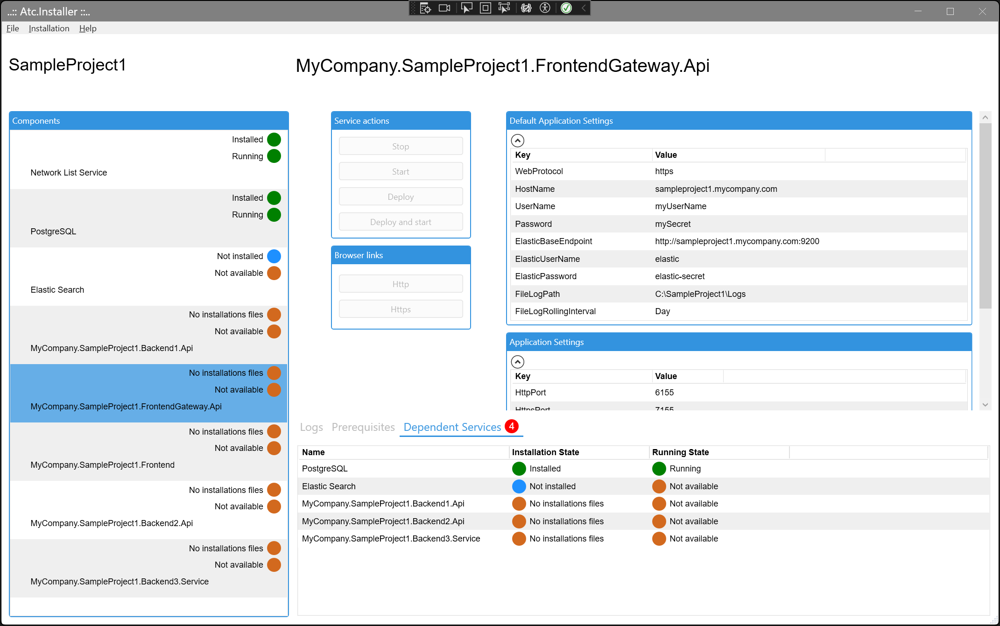
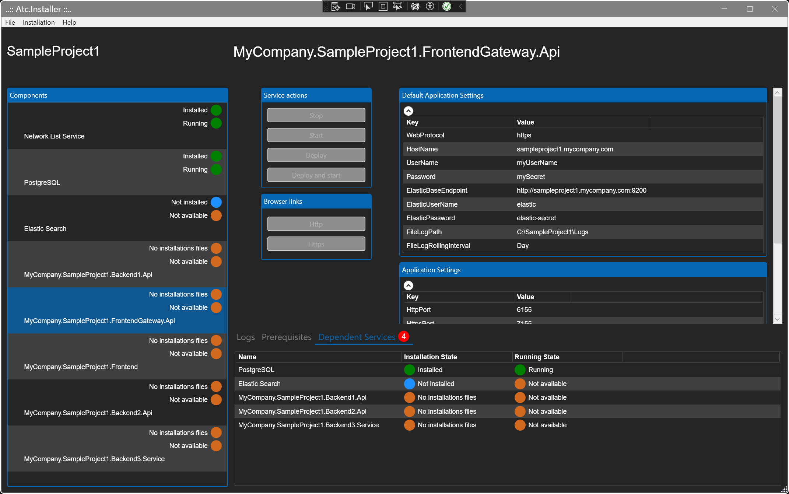
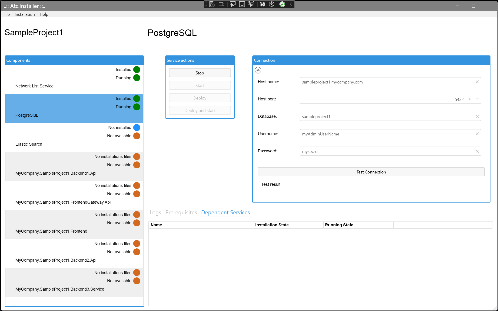
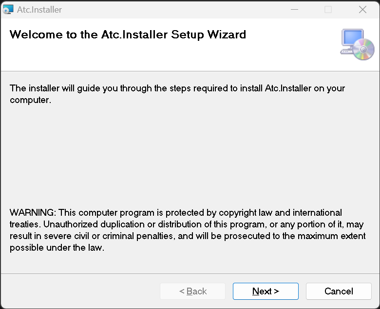
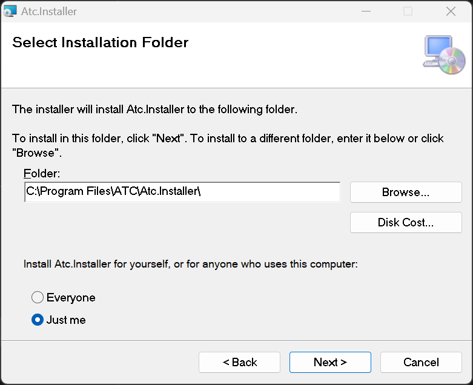

# Atc-installer

Atc.Installer is a windows application that can be installed with the build artifact [Atc.Installer.msi](#MSI-packages-for-Atc.Installer.msi).

The objective with Atc.Installer is to streamline the installation and updating process for Applications, Services, 
and Websites in an [On-Premises](https://www.techslang.com/definition/what-is-on-premises/) Windows environment, 
ensuring efficient management and maintenance.

## Initial glimpse at the application, which comes equipped with a preloaded sample project.

The example is from the installation settings: [SampleProject1-InstallationSettings.json](sample-projects/SampleProject1/SampleProject1-InstallationSettings.json).

| Light-Mode                                 | Dark-Mode                                     |
|--------------------------------------------|-----------------------------------------------|
|  |  |

## Concepts

For a system that requires multiple components in installed on a On-Premises Window machine. 
The Atc.Installer can managed that through an `installation-settings.json` file.

A realworld senerio could be, that the system you have made is:
* A frontend website build in `React` with a backend that use `REST` and maybe use `SignalR`.
* A backend build as `WebApi` in .NET that use a Windows service and a database.
* A `PostgreSQL database`.
* A Windows service like the "Network List Service" (netprofm).

To manage this on a Windows machine a options could be, host the frontend and backend on a `IIS Server`. 
Ensure the PostgreSQL service and "Network List Service" service is running.

For this scenario, 4 components with different tasks and settings must be defined.

Components:

| Description   | Type           | ComponentType              | HostingFrameworkType | Settings         |
|---------------|----------------|----------------------------|----------------------|------------------|
| Frontend      | React          | InternetInformationService | NodeJs               | env.json         |
| Backend       | WebApi         | InternetInformationService | DotNet7              | appsettings.json |
| Database      | PostgreSQL     | PostgreSqlServer           | Native               | ConnectionString |
| Other service | WindowsService | WindowsService             | NativeNoSettings     | No settings      |

Each component can or will have `pre-requisites` of `dependent services` before it makes sens to install or run it.
* Defenitions on `pre-requisites` is - what is needed before installing.
* Defenitions on `dependent services` is - what is needed before trying running it.

Examples on `pre-requisites` could be:
* The fronend needs NodeJs, IIS module "URL rewrite" to be installed.
* The backend needs IIS module "Microsoft .NET Host" and "Microsoft ASP.NET Core" to be installed.

Examples on `dependent services` could be:
* The fronend is dependet on the backend.
* The backend is dependet on the "Network List Service" and the database.

## Examples from SampleProject1

| Component: FrontendGateway API             | Component: PostgreSQL                        |
|--------------------------------------------|----------------------------------------------|
|  |  |

## MSI packages for Atc.Installer.msi

|                              |                              |
|------------------------------|------------------------------|
|  |  |

## Component Types & Hosting Framework Types

Today the Atc.Installer supports a different kind of "Components" that are defined with a combination of `Component Type` and `Hosting Framework Type`.

-> And more can and will come over time.

### Component Types

| Component Type             | Covers Application / Services                                |
|----------------------------|--------------------------------------------------------------|
| Application                | Console, WinForm, Wpf or NodeJs app.                         |
| ElasticSearchServer        | Elastic Search Server                                        |
| InternetInformationService | WebSite (NodeJs-apps, Blazor, ASP.NET), WebApi (REST, gRPC). |
| PostgreSqlServer           | PostgreSql Server                                            |
| WindowsService             | Service                                                      |

### Hosting Framework Types

| Hosting Framework Type     | Underling framework                  |
|----------------------------|--------------------------------------|
| Native                     |                                      |
| NativeNoSettings           |                                      |
| DonNetFramework48          | .NET Framework                       |
| DotNet7                    | .NET                                 |
| NodeJs                     | NodeJs (min. v.18)                   |
